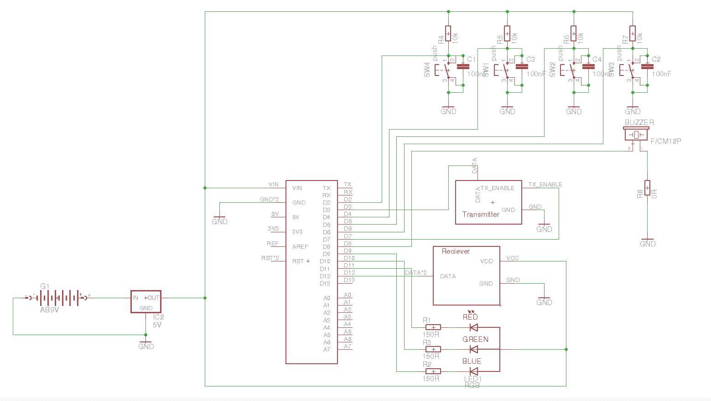

# meshkristall

This project aims to provide a simple board with four buttons and a RGB LED, 
which is capable to communicate over 433 Mhz for interactive radio frequency light installations.

I am planning a case like [this](https://www.youtube.com/watch?v=kgPghSJhkzU) for the board.
The current sketch sends button events over 433 Mhz radio to all other boards. 
Three buttons are connected to the red, green and blue LEDs and the fourth is connected to the remote beepers.
If you press the color buttons, the LED is lit and the current state of buttons is send to the other boards, which show the same color. 
The beeper is only triggered in the remote boards.

Currently the range is only ca. 10 meters, which is nice but not what I need.
As I want to use them as "color telegraphs", they should have a range of 1 kilometer or more.
I will try 2.4 Ghz next. Maybe that works better.

You will find all schematics in this repository.

# Parts list
- [FS1000A](http://www.ebay.de/itm/5X-433-Mhz-RF-Sender-Empfanger-Receiver-Modul-Wireless-Transmitter-MX-05V-DC5V/252441619018?_trksid=p2047675.c100005.m1851&_trkparms=aid%3D222007%26algo%3DSIC.MBE%26ao%3D1%26asc%3D39275%26meid%3D255992112e8d4b46b61d8e5a2a8e73f5%26pid%3D100005%26rk%3D2%26rkt%3D6%26sd%3D322037467813) (433Mhz reciever)
- [XY-MK-5V](http://www.ebay.de/itm/5X-433-Mhz-RF-Sender-Empfanger-Receiver-Modul-Wireless-Transmitter-MX-05V-DC5V/252441619018?_trksid=p2047675.c100005.m1851&_trkparms=aid%3D222007%26algo%3DSIC.MBE%26ao%3D1%26asc%3D39275%26meid%3D255992112e8d4b46b61d8e5a2a8e73f5%26pid%3D100005%26rk%3D2%26rkt%3D6%26sd%3D322037467813)
- [Arduino nano](http://www.ebay.de/itm/MINI-USB-Nano-V3-0-ATmega328P-CH340G-5V-16M-Compatible-Arduino-Nano-V3-0-CY-/191760234382?hash=item2ca5ccf78e:g:Wp8AAOSwYaFWb2dA)

